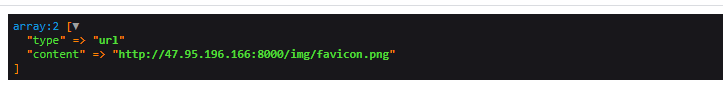

### spider-icon
spider the website's icon by url

### Use tutorial
```php
<?php
use SpiderIcon\Spider;
Spider::request('your url');

```

### Result

```
type 表示获取结果类型 可能值有 url 和base64
content 表示获取结果内容 图片url 或者图片base64
```
